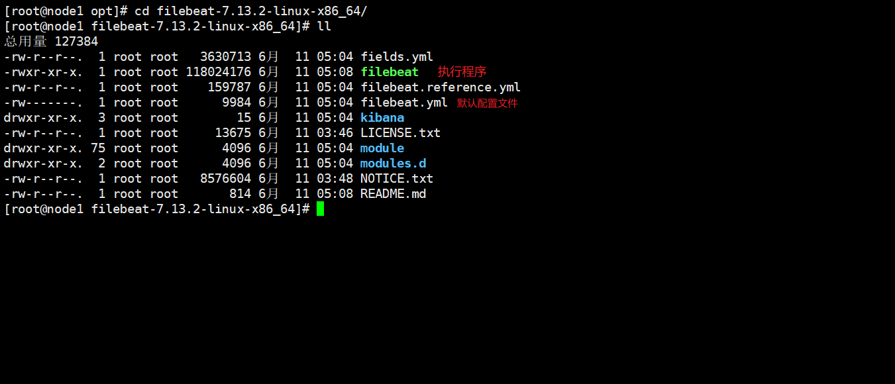

# ELK 架构学习

# 第一章 Beats 

ELK 的组成：


Beats 官网: https://www.elastic.co/cn/beats/

## 1.1 Filebeat

官网：https://www.elastic.co/cn/beats/filebeat

工作架构图:  从日志文件中采集数据并进行传输


### 部署与运行

1.  在 [下载地址](https://www.elastic.co/cn/downloads/beats/filebeat) 中下载对应操作系统的解压包

2. 这里使用 `wget` 将解压包下载到 Linux 上

   ```shell
   wget https://artifacts.elastic.co/downloads/beats/filebeat/filebeat-7.13.2-linux-x86_64.tar.gz
   ```

3. 解压，并进入到对应的目录中

   

4. 额外创建一个配置文件 `byqtxdy.yml` 配置以下内容

   ```yaml
   filebeat.inputs: # 配置输入源
   - type: stdin  # 从哪里收集数据，这里值控制台(stdin)
     enable: true # 是否开启该配置
   output.console: # 配置输入流，这里是输出到控制台上
     pretty: true # 美化
     enable: true # 是否开启该配置
   ```

5. 启动

   ```shell
   ./filebeat -e -c byqtxdy.yml 
   # -e 表示前台启动 -c 表示指定配置文件 -d 输出 debug 信息
   ```

6. 任意输入一个字符串，查看输出的数据

   

   其中 `message` 就是输入的数据

### 读取日志文件

1. 修改 `byqtxdy.yml` 配置文件，添加新的日志输入配置项

   ```yaml
   filebeat.inputs:
   - type: log # 配置日志文件读取方式
     enable: true # 开启该配置
     paths: # 配置日志文件路径，可以指定多个
      - /opt/logs/*.log
   output.console:
     pretty: true
     enable: true
   ```

2. 在 `/opt/logs` 下创建新的 `a.log` 日志文件

3. 启动 filebeat

   

4. 打开新会话，编辑日志文件后查看 filebeats 控制台打印

   ```shell
   vim /opt/logs/a.log
   ==
   byqtxdy
   ==
   ```

   

### 自定义字段

1. 修改 `byqtxdy.yml` 配置文件，添加新配置

   ```yaml
   filebeat.inputs:
   - type: log
     enable: true
     paths:
      - /opt/logs/*.log
     tags: ["servant"] # 配置自定义标签
     fields: # 配置自定义字段
       master: prover # key: value
       wuhu: qifei
     fields_under_root: true # 自定义字段是否添加到根结点
   output.console:
     pretty: true
     enable: true
   ```

2. 重启 `filebeat` 后，修改配置文件后查看控制台

   

### 整合 ElasticSearch

1. 修改 `byqtxdy.yml` 配置文件，添加新配置

   ```yaml
   filebeat.inputs:
   - type: log
     enable: true
     paths:
      - /opt/logs/*.log
     tags: ["servant"]
     fields:
       master: prover
       wuhu: qifei
     fields_under_root: true
   setup.template.settings: 
     index.number_of_shards: 3 # 索引分片数量
   output.elasticsearch: # 配置 es 输出目的地
     hosts: ["192.168.47.1:9200"] # es 主机
   ```

2. 启动 `filebeat`后修改配置文件

   如果出现无法连接 ElasticSearch 的情况，参考: https://blog.csdn.net/qin9800/article/details/106765392

   

3. 通过 HEAD 查看 ES 中的索引信息

   

### 工作原理

#### 1) harvestor 探测器

负责读取单个文件的内容

如果文件在读取时被删除/重命名，filebeat 将继续读取文件

#### 2) prospector 查找器

负责管理 harvestor 并找到所有要读取的文件来源

如果输入类型为**日志**，则查找器会匹配查找路径中的文件，并为每一个文件启动一个 harvestor

filebeat 目前支持两种 prospector 类型: log(日志) & stdin(控制台)

#### 3) Filebeat 如何保持文件状态

- Filebeat 保存每个文件状态并保存到磁盘上的**注册文件**中

- 该状态会记录 harvestor 读取的最后偏移量，并确保发送所有数据行

- 如果输出源(ES/Logstash)无法访问，Filebeat 会追踪最后发送的数据行，并在输出源可用时继续读取文件

- 在 filebeat 运行时，每个 prospector 内存中也会保存文件状态信息

  当 filebeat 重新启动时，将使用**注册文件来重建文件状态**，保证每个 harvestor 再从最后偏移量继续读取

- 文件状态记录保存在 `data/registry` 文件夹中


### Module

> filebeat 中含有大量的 Module，可以简化我们的配置

查看 `modules`:

```shell
./filebeat modules list
```

启动/禁用 module

```shell
./filebeat modules enable/disabled redis
```

开启相关配置的框架，都可以在 `modules.d/` 目录下查看配置文件


#### 1) 整合 redis

1. 开启 filebeat 整合 redis 的 modules

   ```shell
   ./filebeat modules enable redis
   ```

2. 开启 redis 的日志功能

   ```shell
   # 进入 redis.conf [redis 配置文件]
   loglevel debug # 指定日志级别
   logfile "/usr/local/bin/logs/redis.log" # 日志存储文件
   ```

3. 修改 filebeat 整合 redis 的配置文件

   ```shell
   - module: redis
     # Main logs
     log:
       enabled: true
       var.paths: ["/usr/local/bin/logs/.log"] # 配置日志文件所在地
     slowlog:
       enabled: true
   ```

4. 创建一个 filebeat 配置文件，避免混淆

   ```shell
   filebeat.config.modules:
     path: ${path.config}/modules.d/*.yml
     reload.enabled: false
   setup.template.settings:
     index.number_of_shards: 3
   output.elasticsearch:
     hosts: ["10.1.53.30:9200"]
   ```

5. 启动 filebeat 和 Redis

   ```shell
   ./filebeat -e -c filebeat-redis.yml
   ```

6. 查看 es

   

7. 更多 Module 可以查看官网: https://www.elastic.co/guide/en/beats/filebeat/7.13/filebeat-modules.html

## 1.2 Metricbeat

# 第二章 Kibana

