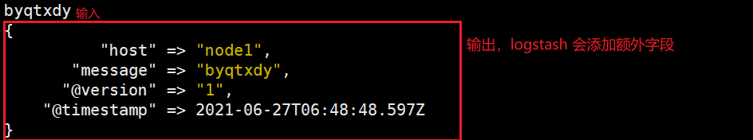
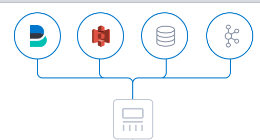
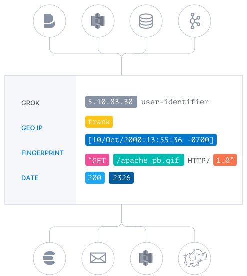
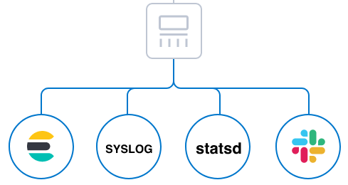
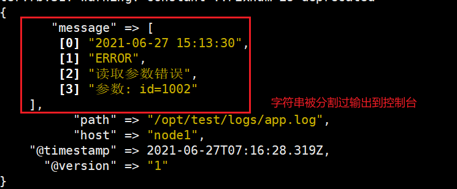
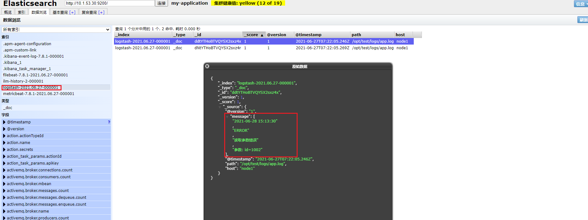

# ELK 架构学习

# 第一章 Beats 

ELK 的组成：


Beats 官网: https://www.elastic.co/cn/beats/

## 1.1 Filebeat

官网：https://www.elastic.co/cn/beats/filebeat

工作架构图:  从日志文件中采集数据并进行传输


### 部署与运行

1.  在 [下载地址](https://www.elastic.co/cn/downloads/beats/filebeat) 中下载对应操作系统的解压包

2. 这里使用 `wget` 将解压包下载到 Linux 上

   ```shell
   wget https://artifacts.elastic.co/downloads/beats/filebeat/filebeat-7.8.1-linux-x86_64.tar.gz
   ```

3. 解压，并进入到对应的目录中

   

4. 额外创建一个配置文件 `byqtxdy.yml` 配置以下内容

   ```yaml
   filebeat.inputs: # 配置输入源
   - type: stdin  # 从哪里收集数据，这里值控制台(stdin)
     enable: true # 是否开启该配置
   output.console: # 配置输入流，这里是输出到控制台上
     pretty: true # 美化
     enable: true # 是否开启该配置
   ```

5. 启动

   ```shell
   ./filebeat -e -c byqtxdy.yml 
   # -e 表示前台启动 -c 表示指定配置文件 -d 输出 debug 信息
   ```

6. 任意输入一个字符串，查看输出的数据

   

   其中 `message` 就是输入的数据

### 读取日志文件

1. 修改 `byqtxdy.yml` 配置文件，添加新的日志输入配置项

   ```yaml
   filebeat.inputs:
   - type: log # 配置日志文件读取方式
     enable: true # 开启该配置
     paths: # 配置日志文件路径，可以指定多个
      - /opt/logs/*.log
   output.console:
     pretty: true
     enable: true
   ```

2. 在 `/opt/logs` 下创建新的 `a.log` 日志文件

3. 启动 filebeat

   

4. 打开新会话，编辑日志文件后查看 filebeats 控制台打印

   ```shell
   vim /opt/logs/a.log
   ==
   byqtxdy
   ==
   ```

   

### 自定义字段

1. 修改 `byqtxdy.yml` 配置文件，添加新配置

   ```yaml
   filebeat.inputs:
   - type: log
     enable: true
     paths:
      - /opt/logs/*.log
     tags: ["servant"] # 配置自定义标签
     fields: # 配置自定义字段
       master: prover # key: value
       wuhu: qifei
     fields_under_root: true # 自定义字段是否添加到根结点
   output.console:
     pretty: true
     enable: true
   ```

2. 重启 `filebeat` 后，修改配置文件后查看控制台

   

### 整合 ElasticSearch

1. 修改 `byqtxdy.yml` 配置文件，添加新配置

   ```yaml
   filebeat.inputs:
   - type: log
     enable: true
     paths:
      - /opt/logs/*.log
     tags: ["servant"]
     fields:
       master: prover
       wuhu: qifei
     fields_under_root: true
   setup.template.settings: 
     index.number_of_shards: 3 # 索引分片数量
   output.elasticsearch: # 配置 es 输出目的地
     hosts: ["192.168.47.1:9200"] # es 主机
   ```

2. 启动 `filebeat`后修改配置文件

   如果出现无法连接 ElasticSearch 的情况，参考: https://blog.csdn.net/qin9800/article/details/106765392

   

3. 通过 HEAD 查看 ES 中的索引信息

   

### 工作原理

#### 1) harvestor 探测器

负责读取单个文件的内容

如果文件在读取时被删除/重命名，filebeat 将继续读取文件

#### 2) prospector 查找器

负责管理 harvestor 并找到所有要读取的文件来源

如果输入类型为**日志**，则查找器会匹配查找路径中的文件，并为每一个文件启动一个 harvestor

filebeat 目前支持两种 prospector 类型: log(日志) & stdin(控制台)

#### 3) Filebeat 如何保持文件状态

- Filebeat 保存每个文件状态并保存到磁盘上的**注册文件**中

- 该状态会记录 harvestor 读取的最后偏移量，并确保发送所有数据行

- 如果输出源(ES/Logstash)无法访问，Filebeat 会追踪最后发送的数据行，并在输出源可用时继续读取文件

- 在 filebeat 运行时，每个 prospector 内存中也会保存文件状态信息

  当 filebeat 重新启动时，将使用**注册文件来重建文件状态**，保证每个 harvestor 再从最后偏移量继续读取

- 文件状态记录保存在 `data/registry` 文件夹中


### Module

> filebeat 中含有大量的 Module，可以简化我们的配置

查看 `modules`:

```shell
./filebeat modules list
```

启动/禁用 module

```shell
./filebeat modules enable/disabled module_name
```

开启相关配置的框架，都可以在 `modules.d/` 目录下查看配置文件


#### 1) 整合 Nginx

1. 开启 filebeat 整合 redis 的 modules

   ```shell
   ./filebeat modules enable nginx
   ```

2. 修改 filebeat 整合 nginx 的配置文件

   ```shell
   - module: nginx
     access:
       enabled: true
       var.paths: ["/usr/local/nginx/logs/access.log*"]
     error:
       enabled: true
       var.paths: ["/usr/local/nginx/logs/error.log*"]
   ```

3. 创建一个 filebeat 配置文件，避免混淆

   ```shell
   filebeat.config.modules:
     path: ${path.config}/modules.d/*.yml
     reload.enabled: false
   setup.template.settings:
     index.number_of_shards: 3
   output.elasticsearch:
     hosts: ["10.1.53.30:9200"]
   ```

4. 启动 filebeat 和 Nginx

   ```shell
   ./filebeat -e -c filebeat-nginx.yml
   ```

5. 查看 es

   

6. 更多 Module 可以查看官网: https://www.elastic.co/guide/en/beats/filebeat/7.13/filebeat-modules.html

## 1.2 Metricbeat

定期收集操作系统或应用服务的指标数据，存储在 ES ，进行实时分析

### Metricbeat 组成 

- Module: 收集的对象，如 mysql/redis/等
- Metricset: 收集指标的集合，如 CPU/内存/网络等

以 Redis Module 为例


### 部署和收集系统指标

1. 在 [下载地址](https://www.elastic.co/cn/downloads/beats/metricbeat) 中下载对应的压缩包

2. 这里使用 Linux 中的  `wget` 下载对应的压缩包

   ```shell
   wget https://artifacts.elastic.co/downloads/beats/metricbeat/metricbeat-7.8.1-linux-x86_64.tar.gz
   ```

3. 解压并进入到对应的目录中

4. 修改默认的配置文件 `metricbeat.yml`

   ```yaml
   setup.template.settings:
     index.number_of_shards: 3 # [可选] 修改 ES 索引的分片数量
   output.elasticsearch:
     # 配置 ES
     hosts: ["10.1.53.30:9200"]
   ```

5. 默认是部署了收集系统指标的，所以直接开启即可

   ```shell
   ./metricbeat -e
   ```

6. 查看 ES

   

### Module

- 查看开启/禁用的 Module

  ```shell
  ./metricbeat modules list
  ```

- 开启/禁用 Module

  ```shell
  ./metricbeat modules enable/disabled module_name
  ```

- 可以在 `modules.d` 下查看对应的配置文件

  ```yaml
  - module: system # 模块名
    period: 10s # 间隔，每隔一定时间进行监控后发送数据给 ES
    metricsets: # 监控的指标
      - cpu
      - load
      - memory
      - network
      - process
      - process_summary
      - socket_summary
      #- entropy
      #- core
      #- diskio
      #- socket
      #- service
      #- users
  ...
  ```

### Nginx Module

#### 1) 开启 Nginx 状态查询

1. 重新编译 Nginx 开启状态查询，进入到 Nginx 的压缩包中输入以下命令

   ```shell
   ./configure --with-stream --prefix=/usr/local/nginx --with-http_stub_status_module
   ```

2. 安装

   ```shell
   make
   make install
   ```

3. 回到 `/usr/local/nginx/sbin` 目录中输入 ==./nginx -v== 查看编译的模块

   

4. 编辑 Nginx 的配置文件，添加状态查询接口

   ```javascript
   location = /nginx-status {
       stub_status on;
       access_log off;
   }
   ```

5. 重启 Nginx，访问对应的状态服务接口

   

   `Active connection`: 正在处理的活动连接数

   `server accepts handled requests:` 三个数字，分别表示:

   1. Nginx 启动到现在一共处理的连接数
   2. Nginx 启动到现在一共成功创建握手数
   3. 表示总共处理的请求数
   4. **请求丢失数 = 连接数 - 握手数**

   Reading: Nginx 读取到客户端的 Header 信息数

   Writiing: Nginx 返回给客户端 Header 信息数

   Waitiing: Nginx 已经处理完成正在等待下一条请求指令的驻留链接(开启 keep-alive 的情况下，该值为 Active - (Reading + Writing))

#### 2) 配置 Nginx Module

1. 启动 Nginx Module

   ```shell
   ./metricbeat modules enable nginx
   ```

2. 修改 `modules.d` 文件夹下的 `nginx.yml` 配置文件

   ```yaml
   - module: nginx
     #metricsets:
     #  - stubstatus
     period: 10s
   
     # Nginx Hosts
     hosts: ["http://192.168.127.139"]
   
     # Nginx 状态查询接口
     server_status_path: "nginx-status"
   ```

3. 启动 metricbeat 服务

   ```shell
   ./metricbeat -e
   ```

4. 查看 ES

   

5. 更多 Module: https://www.elastic.co/guide/en/beats/metricbeat/current/metricbeat-modules.html

# 第二章 Kibana

官网：https://www.elastic.co/cn/kibana

是一款开源的 **数据分析和可视化平台**，作为 Elastic Stack 成员之一，设计用于和 ES 协作。可以通过 Kibana 对 ES 中的索引数据进行搜索，查看，交互操作。利用图表、表格及地图对数据进行多元化的分析和呈现

## 2.1 安装

> 注意: Kibana 依赖于 node.js 且 保证尽量保证 Kibana 和 ES 版本一致

1. 在 [下载地址](https://www.elastic.co/cn/downloads/kibana) 中找到对应的压缩包

2. 这里使用 Linux 的 `wget` 获取对应的压缩包

   ```shell
   https://artifacts.elastic.co/downloads/kibana/kibana-7.8.1-linux-x86_64.tar.gz
   ```

3. 解压并进入对应的目录中

   ```shell
   tar -zxvf kibana-7.8.1-linux-x86_64.tar.gz
   ```

4. 编辑 `conf/kibana.yml` 

   ```yaml
   server.host: "192.168.127.139" # kibana 对外暴露服务
   elasticsearch.hosts: ["http://10.1.53.30:9200"] # es 地址
   i18n.locale: "zh-CN" # 国际化
   ```

5. 启动 Kibana(第一次启动慢正常)

   ```shell
   ./bin/kibana --allow-root
   ```

6. 访问 http://192.168.127.139:5601

   

## 2.2 功能说明

> 

### 数据探索

> 通过可视化查看索引数据

1. 创建索引模式

   

   

2. 查看指定字段

   

###  Metricbeat 指标仪表盘

1. 修改 Metricbeat 配置文件

   ```yaml
   setup.kibana:
     host: "192.168.127.139:5601" # 指定kibana 地址
   ```

2. 向 Kafka 中安装 Metricbeat (需要等待一段时间)

   ```shell
   ./metricbeat setup --dashboards
   ```

3. 回到 kibana 中查看仪表盘数据

   

4. 查看 Nginx 相关指标

   

5. 查看系统相关指标

   

### Filebeat 日志仪表盘

1. 修改 filebeat 配置文件, 添加相关配置项

   ```yaml
   setup.kibana:
     host: "192.168.127.139:5601"
   ```

2. 向 Kibana 中安装 filebeat 仪表盘

   ```shell
   ./filebeat -c filebeat-nginx.yml setup
   ```

3. 启动 filebeat，回到 Kibana 中查看 Nginx 日志仪表盘数据

   

   日志概述

   

   反向代理访问和错误日志详情

   

### 自定义图表

1. 在 `visualize` 菜单项中点击 ==创建可视化== 选择要创建的图表类型

   

2. 选择数据源

   

3. 配置图表数据

   

4. 保存图表

   

   

5. 使用多个**图表**创建==仪表盘==(记得保存)

   

# 第三章 Logstash

> 官网：https://www.elastic.co/cn/logstash

## 3.1 安装与部署


1. 在 [下载地址](https://www.elastic.co/cn/downloads/past-releases#logstash) 选择合适的版本以及对应的操作系统，这里使用 `wget`下载对应的压缩包

   ```shell
   wget https://artifacts.elastic.co/downloads/logstash/logstash-7.8.1.tar.gz
   ```

   注意：需要 jdk1.8+ 的环境才能使用

2. 解压并进入到对应的目录中

3. 输入以下命令，启动 Logstash

   ```shell
   ./bin/logstash -e "input { stdin { } } output { stdout { } }"
   ```

   以上配置表示从控制台采集数据并输出到控制台，启动过程较慢(因为基于 java 开发)

4. 输入任意字符串

   

## 3.3 配置说明

logstash 的配置分三部分

```javascript
input { // 输入
    stdin {  } // 标准输入(控制台)
}
filter { // 过滤，对数据进行分割，截取等处理
    
}
output { // 输出
    stdout { } // 标准输出(控制台)
}
```

### 输入

- 可以采集各种样式，大小和来源的数据，即使数据格式不同

- Logstash 支持各种输入选择，可以在同一时间内从众多来源内捕捉数据，然后以连续的 **流式传输方式**，从日志/指标/Web应用/数据存储/AWS服务采集数据

  


### 过滤

- 实时解析和转换数据

- 数据从源传输到存储库的过程中，Logstash 过滤器能够**解析各个事件**，识别**已命名的字段以构建结构**，并将它们转换成**通用格式**，以便进行更强大的分析和实现商业价值。

  > 
  >
  > 利用 Grok 从非结构化数据中派生出结构
  >
  > 从 IP 地址破译出地理坐标
  >
  > 将 PII 数据匿名化，完全排除敏感字段
  >
  > 简化整体处理，不受数据源、格式或架构的影响

### 输出

- Logstash 提供**众多输出选择**，您可以将数据发送到您要指定的地方，并且能够灵活地解锁众多下游用例。

  (尽管 Elasticsearch 是首选输出方向，能够为我们的搜索和分析带来无限可能，但它并非唯一选择。)

  

## 3.4 读取自定义日志文件

1. 创建一个 `logstash-default.conf`  配置文件，读取输入过滤输出规则

   ```javascript
   input {
     file { // 从文件中输入
       path => "/opt/test/logs/app.log" // 指定文件路径
       start_position => "beginning" // 偏移量
     }
   }
   
   filter { // 过滤规则
     mutate {
       split => {"message"=>"|"} // 以 | 为单位分割字符串
     }
   }
   
   output {
     stdout { codec => rubydebug } // 输出到控制台
   }
   ```

2. 创建对应的配置文件，并写入对应规则的数据

   ```shell
   echo "2021-06-27 15:13:30|ERROR|读取参数错误|参数: id=1002" >> /opt/test/logs/app.log
   ```

3. 启动 logstash，观察控制台输出

   ```shell
   ./bin/logstash -f logstash-default.conf
   ```

   

输出到 ElasticSearch 中:

1. 修改 `logstash-default.conf` 配置文件中的输出配置

   ```javascript
   output {
     // stdout { codec => rubydebug }
     elasticsearch {
       hosts => ["10.1.53.30:9200"]
     }
   }
   ```

2. 重启 logstash

   ```shell
   ./bin/logstash -f logstash-default.conf
   ```

3. 查看 ES

   

# 第四章 综合练习